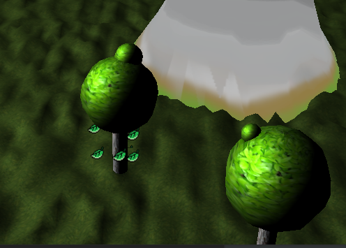

# Project 3D Graphics

Paul Grandhomme

Mattéo Decorsaire

Mathis Grange

## Get Started

## Requirements

### 1. Modeling

> Model at least one element with hierarchical and procedurally generated geometry. 
> This could typically be a plant with hierarchical branches. 
> By procedural, we mean that the geometry needs to be generated by your code and not simply loaded from a 3D model file. 
> The generation could be on GPU or CPU but should not use any external dependency outside the ones already provided with the code base

> Model at least one other part of the scene or terrain procedurally. Again, by procedural, we mean that the geometry needs to be generated by your own code, with no external dependency.

### 2. Rendering

> Use lights and materials

> Render a fog effect on GPU in your shader, where the color/luminance is attenuated in real time as a function of distance to the observer.

> Render the surroundings (sky, background scenery) with a true skybox. By true skybox, we mean that the skybox should always be perceived at infinity (no parallax) and the observer could never get out of it. This means neutralizing the translational component of whatever proxy primitives or geometry you will use to render the skybox

> Render a particle system with e.g. splatting or textured billboards (e.g. smoke), or alternatively render a water surface effect (reflection/refraction, etc

### 3. Animation

> Animate one element with keyframes (to move it or change one of its properties)

> Create a fluid animation (water, lava, smoke) with a technique of your choosing. This could be optionally 

> Control one element with the keyboard

We can move the Trackball with directionnal arrow keys.

#### 4. Optimizations

> Demonstrate in your project that you are careful in your resource usage
> Show at least one speed / efficiency optimization

#### 5. Other effect of your choice

We chose to apply gamma correction.

